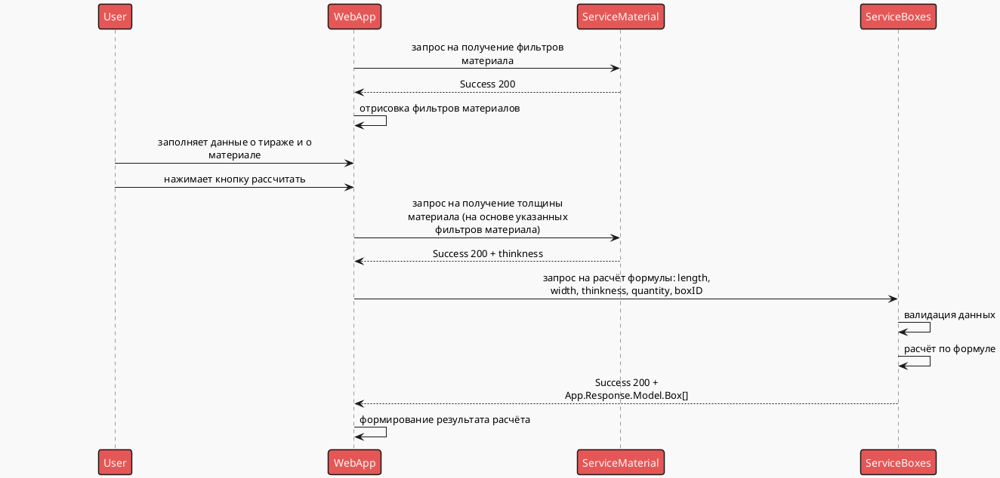
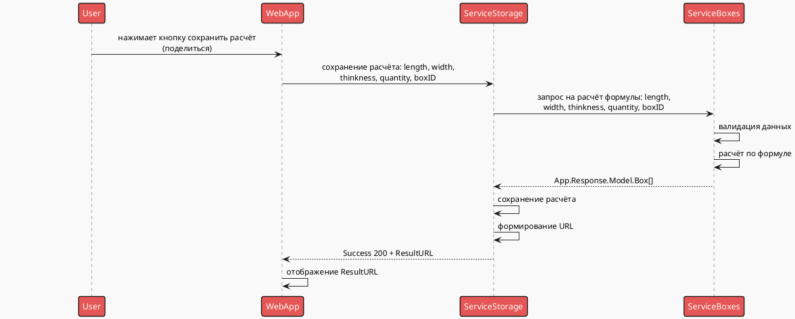
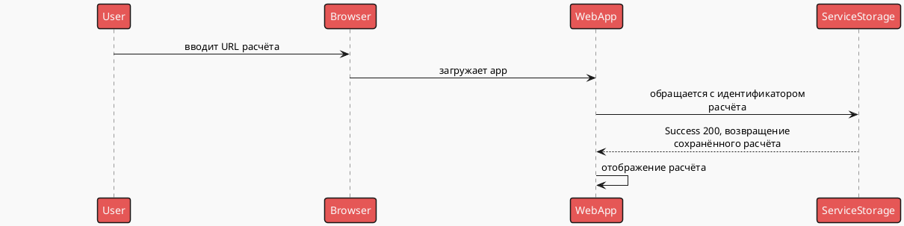

### Расчёт веса и объема листовок

```plantuml
@startuml
!theme mars

skinparam {
    MaxMessageSize 250
}

skinparam sequence {
    ParticipantPadding 125
    MessageAlign center
}

participant "User" as user order 10
participant "WebApp" as app order 20
participant "ServiceMaterial" as sm order 30
participant "ServiceBoxes" as sb order 40

app -> sm: запрос на получение фильтров материала
app <-- sm: Success 200
app -> app: отрисовка фильтров материалов

user -> app: заполняет данные о тираже и о материале
user -> app: нажимает кнопку рассчитать

app -> sm: запрос на получение толщины материала (на основе указанных фильтров материала)
app <-- sm: Success 200 + thinkness

app -> sb: запрос на расчёт формулы: length, width, thinkness, quantity, boxID
sb -> sb: валидация данных
sb -> sb: расчёт по формуле
app <-- sb: Success 200 + App.Response.Model.Box[]
app -> app: формирование результата расчёта

@enduml
```

### Сохранение расчёта

```plantuml
@startuml
!theme mars

skinparam {
    MaxMessageSize 250
}

skinparam sequence {
    ParticipantPadding 125
    MessageAlign center
}

participant "User" as user order 10
participant "WebApp" as app order 20
participant "ServiceStorage" as ss order 30
participant "ServiceBoxes" as sb order 40

user -> app: нажимает кнопку сохранить расчёт (поделиться)
app -> ss: сохранение расчёта: length, width, thinkness, quantity, boxID
ss -> sb: запрос на расчёт формулы: length, width, thinkness, quantity, boxID
sb -> sb: валидация данных
sb -> sb: расчёт по формуле
ss <-- sb: App.Response.Model.Box[]
ss -> ss: сохранение расчёта
ss -> ss: формирование URL
app <-- ss: Success 200 + ResultURL
app -> app: отображение ResultURL

@enduml
```

### Отображение результата расчёта

```plantuml
@startuml
!theme mars

skinparam {
    MaxMessageSize 250
}

skinparam sequence {
    ParticipantPadding 125
    MessageAlign center
}

participant "User" as user order 10
participant "Browser" as browser order 15
participant "WebApp" as app order 20
participant "ServiceStorage" as ss order 30

user -> browser: вводит URL расчёта
browser -> app: загружает app
app -> ss: обращается с идентификатором расчёта
app <-- ss: Success 200, возвращение сохранённого расчёта
app -> app: отображение расчёта

@enduml
```