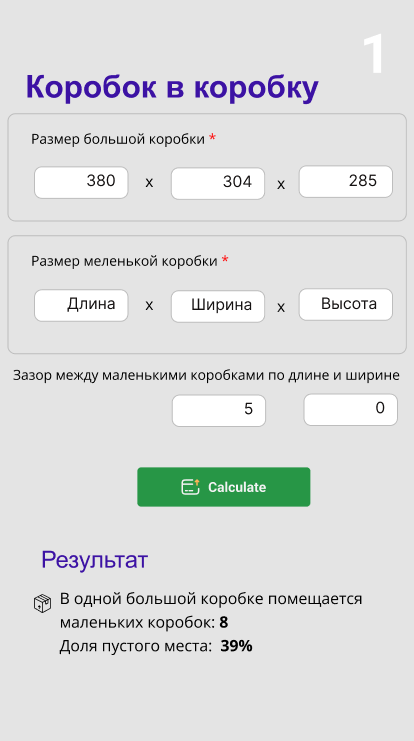

### Виджет сколько коробок помещается в большую коробку

Добавить в UI поля "зазоры между коробками" itemDistance

Задача найти максимальное возможное заполнение коробок.

- Проверяем помещается ли коробка в коробку.
- Коробки на бок не поворачиваем, только поворот остатка. Симметрию не проверяем.
- Считаем раскладку по дну используя длину и ширину коробок (первые два поля)

  
[Прототип в Figma](https://www.figma.com/proto/IR6FyDyMlyLhJazR1kleIu/calc?page-id=1307%3A18&node-id=2913-1339&viewport=2334%2C-7580%2C0.87&t=E734VJ5NyFJUVrwL-1&scaling=min-zoom&content-scaling=fixed&starting-point-node-id=1314%3A53&show-proto-sidebar=1)

Request:
````
{
"itemFormat": "100x200x300",
"outFormat": "600x400x500",
"itemDistance": "5x3"
}
````


Result:
````
[
{
"name": "Результат 1",
"result":
{
"layout": {
"width": 0.21,
"height": 0.297
},
"fragments": [
{
"byWidth": 27,
"byHeight": 43
}
],
"total": 7,
"garbage": 20
}
},
{
"name": "Результат 2",
"result":
{
"layout": {
"width": 0.21,
"height": 0.297
},
"fragments": [
{
"byWidth": 27,
"byHeight": 43
}
],
"total": 8,
"garbage": 12
}
},
]
````
