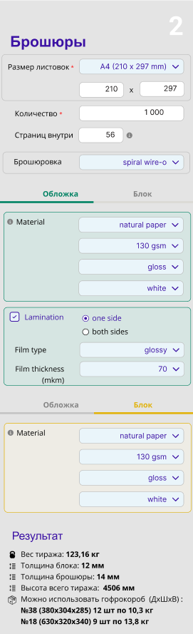

### Виджет расчет веса брошюр, необходимого количества коробок

- Считаем вес обложки с учетом ламинации (если есть).
- Считаем вес блока.
- Считаем коробки, раскладку по дну используем длину и ширину брошюры

  
[Прототип в Figma](https://www.figma.com/proto/IR6FyDyMlyLhJazR1kleIu/calc?page-id=1307%3A18&node-id=2213-1004&viewport=1292%2C-5712%2C0.65&t=EPPcveus7XZcflyg-1&scaling=min-zoom&content-scaling=fixed&starting-point-node-id=1314%3A53&show-proto-sidebar=1)
