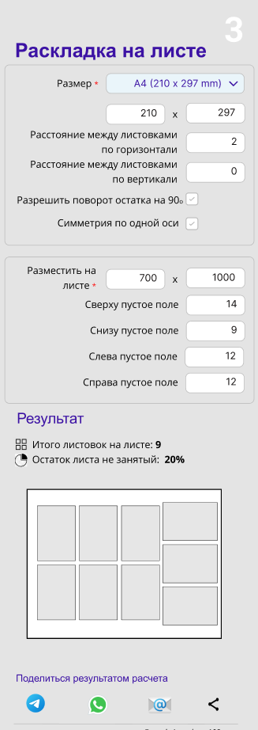

### Виджет спуск полос

+ 

Задача сформировать все возможные варианты спуска полос и отсортировать по наименьшему количеству отходов.
Результат работы виджета список вариантов.

На бэкенде из формата листа вычесть поля по периметру и считать формат outFormat с учетом этих полей:
- "Разместить на листе" первое поле (горизонт) уменьшить на слева и справа пустое поле.
- "Разместить на листе" второе поле (вертикаль) уменьшить на сверху и снизу пустое поле.

  
[Прототип в Figma](https://www.figma.com/proto/IR6FyDyMlyLhJazR1kleIu/calc?page-id=1307%3A18&node-id=2213-1540&viewport=589%2C-6403%2C0.78&t=4VdE0S2YQ47Lwip5-1&scaling=min-zoom&content-scaling=fixed&starting-point-node-id=1314%3A53&show-proto-sidebar=1)


Request:
````
{
"itemFormat": "100x200",
"itemDistance": "100x200",
"outFormat": "100x200",
"disableRotation": true,
"useMirror": true
}
````
Может есть смысл "disableRotation" переименовать в "useRotation"

1. Request 1. Сначала рассчитываем с параметрами как задано в форме ().
2. Request 2. Переворачиваем itemFormat: если было 100x200, то второй расчет для 200x100. Остальные параметры не меняем.

Result:
````
[
{
"name": "Результат 1",
"result":
{
"layout": {
"width": 0.21,
"height": 0.297
},
"fragments": [
{
"byWidth": 27,
"byHeight": 43
}
],
"total": 9223372036854776000,
"garbage": 83076403.209471
}
},
{
"name": "Результат 2",
"result":
{
"layout": {
"width": 0.21,
"height": 0.297
},
"fragments": [
{
"byWidth": 27,
"byHeight": 43
}
],
"total": 9223372036854776000,
"garbage": 83076403.209471
}
},
]
````
